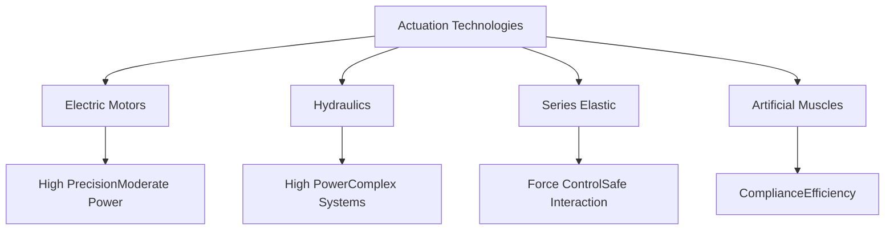

# Chapter 1: Foundations of Physical AI

Understanding Physical AI requires grasping several interconnected concepts from robotics, artificial intelligence, control theory, and biomechanics. This chapter establishes the foundational knowledge that underpins all humanoid robotic systems.

## The Embodiment Challenge

The transition from digital AI to Physical AI introduces what researchers call the "embodiment challenge"—the fundamental difficulties that arise when intelligence must act through a physical body in the real world.

**The Reality Gap**: Simulations are clean, predictable, and fast. Reality is messy, uncertain, and operates in real-time. Physical AI systems must bridge this gap, applying knowledge learned in controlled environments to chaotic real-world situations.

**Physical Constraints**: Digital systems can process information at electronic speeds, but physical movement is limited by inertia, friction, and material properties. A robot cannot instantly change direction or teleport—it must respect the laws of physics.

**Irreversible Actions**: Unlike digital systems where you can simply reset, physical actions have real consequences. A robot that drops a fragile object cannot "undo" that action.

## Degrees of Freedom and Kinematic Chains

A robot's capability is largely determined by its degrees of freedom (DOF)—the number of independent ways it can move. The human body has over 200 DOF when considering all joints, though practical humanoid robots typically use 20-50 DOF to balance capability with complexity.

**Serial vs. Parallel Kinematics**: Most humanoid designs use serial kinematic chains where joints are connected in sequence (like an arm with shoulder, elbow, and wrist). This is intuitive but creates challenges—moving one joint affects the position of all subsequent joints.

**Kinematic Redundancy**: Humans have more DOF than strictly necessary for most tasks. This redundancy allows us to reach the same point in multiple ways, avoid obstacles, and maintain balance while manipulating objects. Replicating this in robots provides similar benefits but complicates control.

**Forward and Inverse Kinematics**: Given joint angles, forward kinematics tells us where the robot's end effector (like a hand) will be. Inverse kinematics solves the harder problem—given a desired end position, what joint angles should we use? For redundant systems, there may be infinite solutions.

## Actuation: From Energy to Motion

Actuation is how robots convert energy into motion. The choice of actuator profoundly affects a robot's capabilities, efficiency, and cost.

**Electric Motors**: The most common choice, electric motors offer precise control and good power density. Brushless DC motors are particularly popular in modern humanoids. They're efficient and reliable but require gearboxes to generate sufficient torque, which can introduce compliance and reduce backdrivability.

**Hydraulic Actuators**: Boston Dynamics' Atlas pioneered the use of hydraulics in humanoid robots, offering exceptional power-to-weight ratios and high force capability. Hydraulics excel at explosive movements and heavy lifting but require complex pumping systems and careful sealing.

**Series Elastic Actuators (SEA)**: These place a spring between the motor and the load, allowing the robot to measure and control force directly. This makes interaction safer and enables compliant behaviors, though it adds mechanical complexity.

**Artificial Muscles**: Emerging technologies like pneumatic artificial muscles and electroactive polymers promise muscle-like actuation—soft, compliant, and energy-efficient. They're still developing but could revolutionize future designs.

## Sensing: The Robot's Window to Reality

Without sensing, a robot is blind and numb. Sensors provide the data that enables perception, which drives intelligent action.

**Proprioception**: Just as humans sense their own body position, robots use encoders, potentiometers, and inertial measurement units (IMUs) to know their joint angles, velocities, and orientation. This internal sensing is crucial for control.

**Exteroception**: Sensors like cameras, lidar, radar, and tactile sensors perceive the external environment. Vision systems are particularly important for humanoids, as humans rely heavily on sight.

**Force/Torque Sensing**: Measuring forces at joints or contact points enables delicate manipulation and safe interaction. Force sensors can be as simple as current measurements in motors or as sophisticated as multi-axis load cells.

**Sensor Fusion**: No single sensor is perfect. Combining multiple sensor types—for example, fusing camera data with lidar—produces more reliable perception than any single sensor alone.

## Control Theory Fundamentals

Control systems determine how robots move from their current state to a desired state. Physical AI systems employ sophisticated control strategies operating at multiple levels.

**PID Control**: Proportional-Integral-Derivative controllers are the workhorses of robot control. They calculate control signals based on the error between desired and actual states. While simple, well-tuned PID controllers are remarkably effective.

**Model Predictive Control (MPC)**: MPC uses a model of the system to predict future states and optimize control actions over a time horizon. This is particularly valuable for locomotion, where balance requires anticipating future states.

**Feedback vs. Feedforward**: Feedback control reacts to errors after they occur. Feedforward control anticipates disturbances and acts preemptively. Effective systems combine both approaches.

**Hierarchical Control**: Humanoid robots typically use layered control architectures—high-level planners decide what to do, mid-level controllers determine how to do it, and low-level controllers execute the motion. This separation of concerns makes complex systems manageable.

## The Integration Challenge

The ultimate challenge in Physical AI is integration—combining mechanics, electronics, sensing, and intelligence into a coherent system that works reliably. Each subsystem must be designed with the others in mind.

**Bandwidth and Latency**: Control loops must run fast enough to stabilize the robot. Modern humanoids typically run low-level control at 1-5 kHz, with higher-level planning at 10-100 Hz.

**Computational Architecture**: Processing sensor data and computing control commands requires significant computation. Humanoids need carefully designed computing systems that balance power consumption, heat generation, and processing capability.

**Fail-Safe Design**: Physical robots can cause damage or injury if they malfunction. Good design includes multiple layers of safety—emergency stops, force limits, redundant sensing, and graceful degradation when components fail.

Understanding these foundations prepares us to dive deeper into the specific challenges of building humanoid robots. In the next chapter, we'll explore the mechanical design principles that bring these concepts to life.