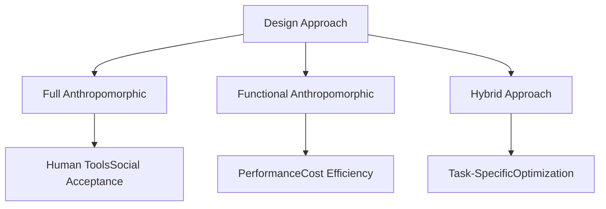
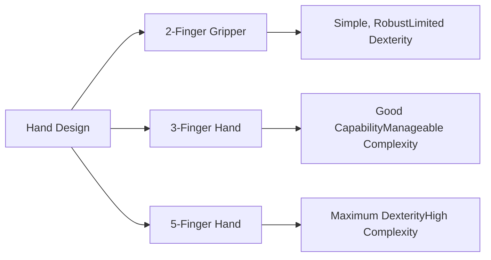

# Chapter 2: Mechanical Design of Humanoids

The mechanical design of a humanoid robot determines its fundamental capabilities and limitations. Every design choice—from overall proportions to joint placement—affects what the robot can do, how efficiently it operates, and how much it costs to build.

## Anthropomorphic Design Philosophy

The decision to build humanoid robots stems from practical considerations, but the degree of human-likeness is a design choice with real consequences.

**Full Anthropomorphism**: Some robots like Honda's ASIMO closely mimic human proportions and appearance. This maximizes compatibility with human environments and tools but may sacrifice performance—humans aren't optimally designed for every task.

**Functional Anthropomorphism**: Modern industrial humanoids like Tesla's Optimus prioritize functional similarity over appearance. They maintain human-scale and general form but optimize internal mechanisms for performance and manufacturability rather than biological fidelity.

**The Uncanny Valley Consideration**: Highly realistic humanoids can provoke discomfort if they're almost but not quite human-like. Many designers deliberately maintain a clearly robotic appearance to avoid this psychological phenomenon.

## Structural Framework and Materials

The skeleton of a humanoid robot must be strong enough to support loads while remaining light enough for efficient movement.

**Material Selection**: Aluminum alloys offer an excellent strength-to-weight ratio and are easy to machine, making them popular for prototypes and lower-cost systems. Carbon fiber composites provide even better weight savings but at higher cost and manufacturing complexity. Titanium offers exceptional strength and is used in high-performance joints and critical components.

**Load Paths**: Smart structural design routes forces through the strongest parts of the structure. In the legs, for instance, actuators can be mounted near the hip where the structure is strongest, using tendons or linkages to transmit force to more distal joints.

**Compliance and Rigidity**: Counterintuitively, some compliance (springiness) in the structure can be beneficial. It provides natural shock absorption during impacts and can store and release energy during walking. However, excessive compliance makes precise control difficult.

**Modularity**: Modern designs favor modular architectures where limbs, joints, and even entire subsystems can be replaced or upgraded independently. This reduces development time, simplifies maintenance, and allows incremental improvements.

## Joint Design and Configuration

Joints are where the robot's skeleton comes alive. Each joint type offers different capabilities and tradeoffs.

**Revolute Joints**: The most common type, revolute joints rotate around a single axis like a door hinge. They're mechanically simple and provide precise control. Human-like joints often require 2-3 revolute joints arranged to create shoulder, hip, or wrist complexities.

**Spherical Joints**: True ball-and-socket joints allow rotation around multiple axes simultaneously. While this matches human anatomy better, they're mechanically complex and difficult to actuate with precise control.

**Practical Joint Counts**: Early humanoids like ASIMO used 34 DOF to closely match human capabilities. Modern designs are more selective—Boston Dynamics' Atlas uses 28 DOF, while Tesla's Optimus has approximately 28-40 DOF depending on the hand configuration. Each additional DOF adds cost, complexity, weight, and control challenges.

**Joint Strength Requirements**: Not all joints need equal strength. Hip and knee joints bear the robot's full weight and require high torque. Neck joints need less strength but more precision. Good design allocates resources where they're most needed.

## Hand Design: The Ultimate Challenge

The human hand, with 27 bones and 34 muscles, is an engineering marvel. Replicating its capabilities in a robot remains one of the hardest challenges in humanoid design.

**Gripper Approaches**: The simplest approach is a two-finger gripper, which can handle many tasks but lacks versatility. Three-finger grippers add significant capability while remaining mechanically simple. Five-finger hands maximize human-like manipulation but dramatically increase complexity.

**Underactuated Hands**: Rather than independently controlling every joint, underactuated designs use fewer actuators with compliant mechanisms that naturally conform to object shapes. This simplifies control while maintaining good grasping capability.

**Tactile Sensing**: Hands need feedback to manipulate objects effectively. Pressure sensors, force sensors, and even artificial skin with distributed sensing enable delicate manipulation and prevent crushing fragile objects.

**Practical Compromises**: Companies like Tesla have demonstrated that a three-finger hand with carefully chosen DOF can handle a remarkable range of tasks while being far simpler than a full five-finger design. The key is identifying which capabilities matter most for target applications.

## Bipedal Locomotion Structure

Walking on two legs is mechanically challenging—humans spend years learning to walk, and even then we occasionally fall. The mechanical design strongly influences how well a robot can walk.

**Leg Configuration**: Most humanoids use a configuration analogous to human legs—hip joints with three DOF, single-axis knees, and multi-axis ankles. This provides good mobility while being mechanically feasible.

**Foot Design**: Feet determine how the robot interacts with the ground. Larger feet provide more stability but reduce agility. Curved or articulated feet can help with energy-efficient walking but complicate control. Some designs include toes for better balance and natural gait.

**Hip Width and Stride**: Wider hips provide lateral stability but reduce walking efficiency. The optimal design depends on whether stability or efficiency is prioritized. Industrial robots often favor stability, while research platforms exploring efficient locomotion use narrower hips.

**Actuator Placement**: Placing heavy actuators near the hip (proximal) rather than the ankle (distal) reduces the inertia of the leg, making it easier to swing. This is why many designs use cable-driven distal joints.

## Power and Energy Systems

A robot is only as capable as its power source allows. Energy systems are often the limiting factor in operating time and capability.

**Battery Technologies**: Modern humanoids primarily use lithium-ion or lithium-polymer batteries, offering reasonable energy density and power delivery. Battery packs are typically placed in the torso to keep the center of mass central and low.

**Operating Time**: Current humanoids operate for 1-8 hours depending on activity level. Walking and manipulation are energy-intensive; idle standing with just balance control can extend operating time significantly.

**Thermal Management**: Motors, electronics, and batteries all generate heat. Effective cooling—whether through heat sinks, fans, or liquid cooling—is essential to prevent damage and maintain performance.

**Quick-Swap Systems**: Some industrial designs use hot-swappable batteries, allowing continuous operation by swapping depleted batteries with charged ones, similar to power tool systems.

## Integration and Packaging

Fitting all the necessary components into a human-sized package requires careful engineering.

**Cable Routing**: Humanoids contain dozens to hundreds of cables for power, communication, and sensing. Routing these cables so they don't snag, wear out, or interfere with movement is a significant challenge.

**Waterproofing and Environmental Protection**: Real-world operation requires protection from dust, moisture, and impacts. Sealing joints and electronics adds weight and complexity but is essential for reliability.

**Serviceability**: Robots break down and need maintenance. Designs that allow easy access to key components, clear diagnostics, and field-replaceable units reduce downtime and operating costs.

The mechanical design sets the stage for everything else. In the next chapter, we'll explore how sensors and perception systems give these mechanical marvels the ability to understand and interact with their environment.