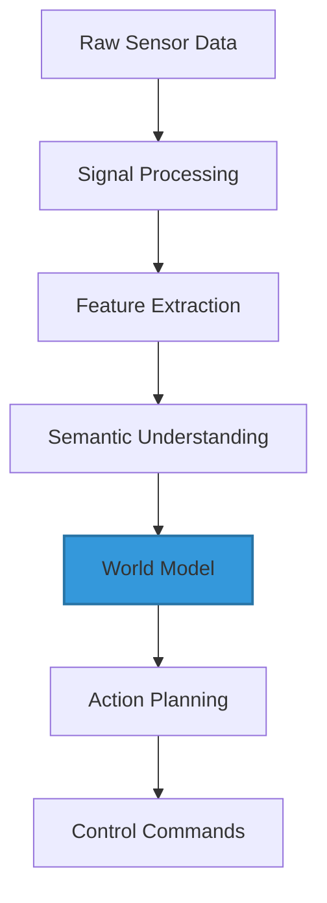
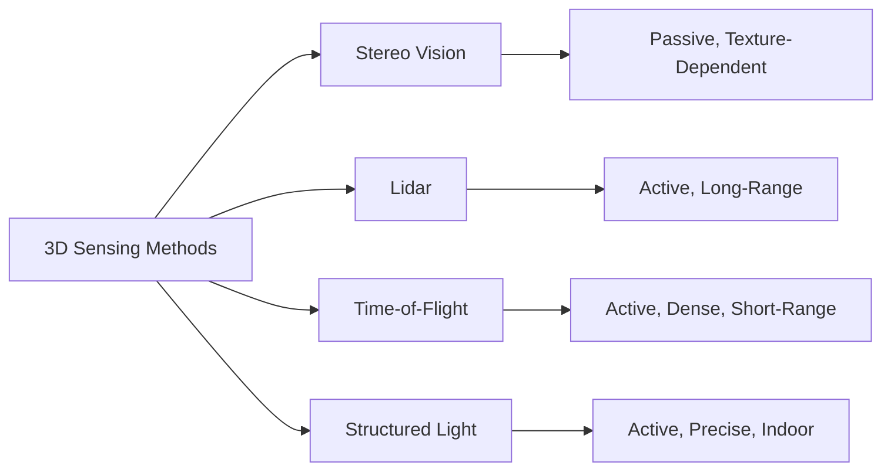
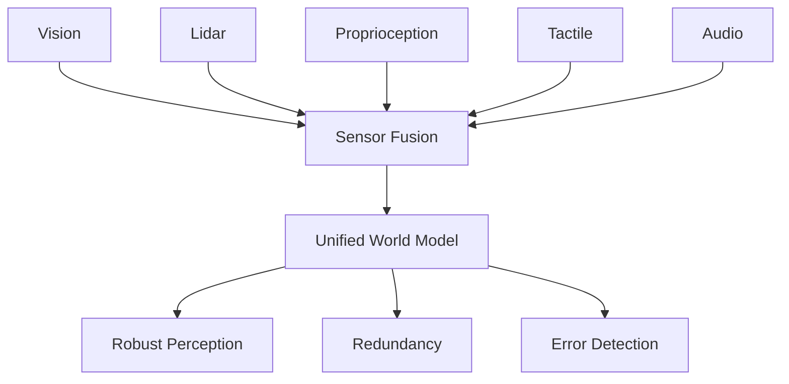

# Chapter 3: Sensing and Perception

A robot without sensing is just an elaborate statue. Sensors provide the raw data about the world, but perception—the process of interpreting that data to understand the environment—is what enables intelligent action. This chapter explores how humanoid robots sense and make sense of their surroundings.

## The Perception Stack

Perception in humanoid robotics operates as a pipeline from raw sensor data to actionable understanding.

**Sensing**: Physical sensors capture environmental data—light patterns, distance measurements, force readings, and more. This produces massive streams of raw data that must be processed efficiently.

**Signal Processing**: Raw sensor data is noisy and requires filtering, calibration, and preprocessing. This stage removes artifacts, compensates for sensor characteristics, and prepares data for higher-level processing.

**Feature Extraction**: Rather than working with raw data, perception systems identify meaningful patterns—edges in images, planes in point clouds, or patterns in force data. Deep learning has revolutionized this stage.

**Semantic Understanding**: Features are combined into meaningful concepts—"this is a chair," "that surface is walkable," or "this object is graspable." This semantic layer enables planning and decision-making.

**World Modeling**: Perception systems build and maintain models of the environment, tracking objects, estimating their properties, and predicting their behavior.

## Visual Perception

Vision is the dominant sensing modality for most humanoid robots, just as it is for humans. However, robotic vision faces unique challenges.

**Camera Configurations**: Most humanoids use stereo camera pairs to enable depth perception, similar to human binocular vision. Some add wide-angle or fisheye cameras for broader situational awareness. Head-mounted cameras on pan-tilt mechanisms extend the field of view.

**RGB-D Cameras**: Depth cameras like Intel RealSense or Microsoft Kinect combine color imaging with direct depth measurement, providing rich 3D information in real-time. However, they struggle in bright sunlight and at longer distances.

**Event Cameras**: Emerging event-based vision sensors detect changes in brightness at each pixel independently, offering ultra-high temporal resolution and low latency. They excel at tracking fast-moving objects and operating in varied lighting conditions.

**Visual Odometry and SLAM**: Simultaneously Localizing and Mapping (SLAM) algorithms use visual features to track the robot's motion and build maps of the environment. Visual odometry provides crucial backup to other navigation sensors.

**Object Detection and Segmentation**: Deep learning models like YOLO, Mask R-CNN, and transformers enable real-time detection and segmentation of objects. These systems can identify dozens of object categories at multiple frames per second.

## Depth and 3D Sensing

Understanding the 3D structure of the environment is crucial for navigation and manipulation.

**Stereo Vision**: By comparing images from two cameras with known separation, robots can calculate depth through triangulation. This works well for textured surfaces but struggles with uniform or transparent surfaces.

**Lidar Systems**: Light Detection and Ranging sensors measure distance by timing laser pulses. Spinning lidars provide 360-degree sensing, while solid-state variants are becoming more compact and robust. Lidar excels at precise distance measurement and works in darkness but struggles with reflective or transparent surfaces.

**Time-of-Flight Cameras**: These illuminate a scene with modulated light and measure the phase shift of reflected light to determine depth. They're fast and provide dense depth maps but have limited range.

**Structured Light**: By projecting known patterns and analyzing their distortion, robots can compute detailed 3D geometry. This approach is very accurate but typically limited to indoor use.

## Proprioceptive Sensing

Understanding its own body state is essential for any robot. Proprioception tells the robot where its limbs are, how fast they're moving, and what forces they're experiencing.

**Encoders**: Optical or magnetic encoders measure joint angles with high precision. Absolute encoders know their position even after power cycling, while incremental encoders are lighter and cheaper but must be homed.

**Inertial Measurement Units (IMUs)**: Accelerometers and gyroscopes measure acceleration and rotational velocity. Fused together, they provide orientation estimates crucial for balance control. Modern MEMS IMUs are tiny, cheap, and accurate enough for most robotics applications.

**Force-Torque Sensors**: Multi-axis load cells measure forces and torques at key points—typically wrists and ankles. These enable force control for delicate manipulation and provide feedback for locomotion.

**Motor Current Sensing**: The current drawn by a motor correlates with the torque it's producing. This provides a simple, lightweight alternative to dedicated force sensors, though with less accuracy.

## Tactile and Contact Sensing

Touch provides information that vision alone cannot—surface texture, compliance, slip, and contact geometry. Effective manipulation requires tactile feedback.

**Force-Sensitive Resistors (FSRs)**: Simple pressure sensors that change resistance under load. They're cheap and easy to integrate but provide only coarse force measurement.

**Capacitive Sensing**: Measuring capacitance changes can detect proximity and contact. Some robots use capacitive sensor arrays to create artificial skin with distributed sensing.

**Optical Tactile Sensors**: Cameras observe the deformation of a soft sensing surface to infer contact forces and geometry. This approach, exemplified by sensors like GelSight, provides remarkably detailed tactile information.

**Slip Detection**: Detecting when a grasped object is slipping allows robots to adjust grip force dynamically—tight enough to prevent dropping, gentle enough to avoid crushing.

## Audio Perception

Sound provides complementary information to vision and can alert robots to events outside their visual field.

**Microphone Arrays**: Multiple microphones enable sound source localization through time-of-arrival differences. This helps robots orient toward speakers or identify directions of important sounds.

**Speech Recognition**: Modern deep learning models enable robust speech recognition even in noisy environments, allowing natural voice interaction with humanoid robots.

**Acoustic Monitoring**: Sounds can indicate system health—unusual motor noises may warn of mechanical problems. Environmental sounds provide context—breaking glass might trigger an alert response.

## Sensor Fusion and Multimodal Perception

No single sensor is perfect. Effective perception combines multiple sensing modalities to overcome individual limitations.

**Kalman Filtering**: A mathematical framework for optimally combining measurements from different sensors, each with their own noise characteristics. Extended and Unscented Kalman Filters handle the nonlinear dynamics typical in robotics.

**Particle Filters**: When the probability distributions aren't Gaussian, particle filters represent beliefs as collections of samples. They're particularly useful for tracking and localization problems.

**Temporal Fusion**: Combining measurements over time provides more reliable estimates than single snapshots. This is crucial for filtering noisy sensors and predicting future states.

**Cross-Modal Validation**: Different sensors can validate each other—visual detection of an object should align with lidar measurements and tactile sensing when grasped. Discrepancies may indicate sensor failures or unusual situations.

## Real-Time Perception Constraints

Perception must operate within strict timing constraints. A robot walking at human speed covers significant distance in the milliseconds it takes to process sensor data.

**Computational Budgets**: Modern perception systems must balance accuracy against computational cost. Running large neural networks at high framerates requires significant GPU resources and careful optimization.

**Latency Management**: Perception latency affects control performance. If it takes 100ms to process vision data, the robot must predict where things will be by the time that data becomes actionable.

**Graceful Degradation**: When computational resources are saturated, systems should degrade gracefully—perhaps reducing framerate or using simpler models—rather than failing catastrophically.

Perception transforms raw sensor data into understanding. In the next chapter, we'll see how this understanding enables one of robotics' greatest challenges—stable, efficient locomotion.

