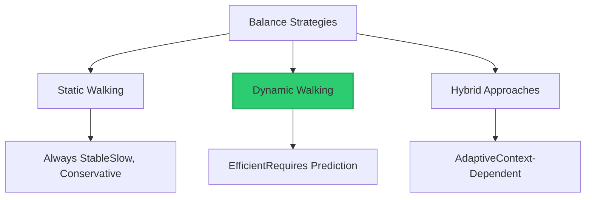
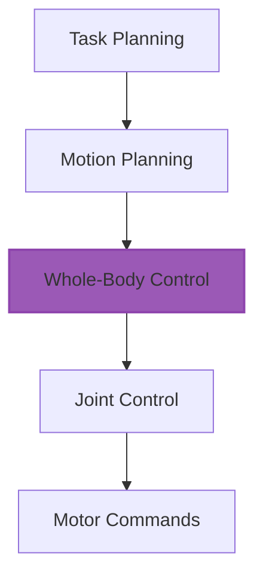

# Chapter 4: Locomotion and Control

Bipedal locomotion is one of the most challenging problems in robotics. Humans learn to walk as toddlers and then take it for granted, but creating a robot that can walk stably, efficiently, and adaptively requires sophisticated control systems and careful engineering. This chapter explores how humanoid robots achieve stable locomotion and precise control.

## The Challenge of Bipedal Stability

Walking on two legs is inherently unstable. Unlike four-legged animals that can maintain a stable base even when stationary, bipedal systems are always on the verge of falling over.

**Static vs. Dynamic Stability**: Static stability means the robot's center of mass stays within its support polygon (the area bounded by contact points). This ensures stability even if motion stops instantly. Dynamic stability allows the center of mass to move outside the support polygon temporarily, as long as forward motion can recover balance—this is how humans actually walk.

**The Inverted Pendulum**: A standing humanoid resembles an inverted pendulum—naturally unstable, requiring constant active control. Unlike a regular pendulum that returns to equilibrium, an inverted pendulum will fall without intervention.

**Zero Moment Point (ZMP)**: The ZMP is the point where the total reaction force effectively acts on the ground. For stable walking, the ZMP must stay within the support polygon. Much of humanoid walking research has focused on ZMP-based control.

## Gait Generation and Planning

Before a robot can walk, it must plan how to walk—determining foot placement, timing, and the trajectory of its center of mass.

**Trajectory Optimization**: Mathematical optimization finds the best foot trajectories and joint angles that achieve stable walking while minimizing energy, time, or other costs. These computations can be done offline for known gaits or online for adaptive walking.

**Pattern Generators**: Central Pattern Generators (CPGs), inspired by neural circuits in animals, produce rhythmic movement patterns. Oscillators can be coupled to generate coordinated limb motions without explicit trajectory planning.

**Footstep Planning**: Higher-level planning determines where to place feet to navigate terrain, avoid obstacles, and maintain balance. This involves geometric reasoning about support polygons and reachable foot positions.

**Preview Control**: Model Predictive Control looks ahead several steps to plan movements that maintain stability not just now, but over the next few seconds. This anticipatory control is crucial for dynamic walking.

## Control Hierarchies

Humanoid control systems operate at multiple levels, from high-level task planning down to individual motor commands.

**Task-Level Control**: At the highest level, the robot decides what to do—walk to a location, pick up an object, climb stairs. This involves path planning, task sequencing, and decision-making.

**Operational Space Control**: The middle layer translates tasks into desired motions for the robot's end effectors (hands, feet, head). Rather than thinking in joint angles, this layer reasons about Cartesian space positions and forces.

**Joint-Level Control**: The lowest level controls individual joints to achieve desired positions, velocities, or torques. PID controllers or more sophisticated model-based controllers operate here, typically at high frequencies (1-5 kHz).

**Whole-Body Control**: Modern approaches optimize control across the entire robot simultaneously, respecting physical constraints and prioritizing multiple objectives. This enables complex behaviors like walking while carrying heavy loads or maintaining balance on uneven terrain.

## Balance and Stabilization

Maintaining balance requires continuous feedback and rapid response to disturbances.

**Ankle Strategy**: For small disturbances, adjusting ankle torques can restore balance while keeping feet planted. This is energy-efficient but has limited range.

**Hip Strategy**: Larger disturbances require hip movements to shift the center of mass. This is more powerful but uses more energy and affects upper body position.

**Stepping Strategy**: When disturbances are too large for ankle or hip strategies, the robot must take a step. Detecting when stepping is necessary and quickly computing safe foot placement is critical for preventing falls.

**Momentum Control**: Managing angular momentum helps maintain balance. Swinging arms opposite to leg movements (like humans do) can reduce upper body rotation and improve stability.

**Capture Point and Divergent Component of Motion**: Advanced balance controllers use concepts like the capture point—the place a robot must step to come to a complete stop. The DCM framework provides rigorous mathematical tools for analyzing and controlling balance.

## Adaptive and Robust Locomotion

Real-world walking requires adapting to terrain, disturbances, and unexpected events.

**Terrain Adaptation**: Perception systems identify terrain characteristics—slope, roughness, compliance. The walking controller adjusts gait parameters, foot placement, and posture accordingly.

**Push Recovery**: Humans can recover from significant pushes or pulls. Robots need similar capabilities, detecting disturbances quickly and responding with appropriate stepping or bracing strategies.

**Compliant Control**: Rather than rigidly following trajectories, compliant control allows deviation in response to external forces. This prevents damage and enables gentler interaction with the environment.

**Learning from Experience**: Machine learning techniques can improve locomotion over time. Reinforcement learning policies adapt to specific platforms and environments, while online learning allows real-time adjustment to changing conditions.

## Energy Efficiency

Bipedal walking is energy-intensive. Improving efficiency extends operating time and makes humanoids more practical.

**Passive Dynamics**: Human walking is partially passive—gravity and momentum contribute significantly to the motion, reducing muscular effort. Robots can exploit similar principles, though their mass distribution and actuation differ from biological systems.

**Energy Regeneration**: When lowering loads or decelerating, motors can act as generators, recovering energy to batteries. This regenerative braking can recapture 10-30% of energy in cyclic activities like walking.

**Gait Optimization**: Different gaits have different energy costs. Walking slowly with static stability uses less power than dynamic running, but dynamic gaits may be more efficient at higher speeds. Optimizing gait parameters for specific tasks improves efficiency.

**Mechanical Energy Storage**: Springs in series with actuators can store and release energy during cyclic motions. This reduces peak power requirements and improves overall efficiency, though it adds mechanical complexity.

## Manipulation Control

Beyond locomotion, humanoids must manipulate objects with precision and appropriate force.

**Impedance Control**: Rather than strictly controlling position, impedance control specifies the relationship between force and displacement. This allows compliant interaction—the robot can adjust to contact forces like when inserting a peg into a hole.

**Hybrid Position-Force Control**: Some tasks require controlling position in certain directions and force in others. For example, when wiping a surface, maintain contact force perpendicular to the surface while controlling position parallel to it.

**Grasp Planning**: Selecting contact points and grip forces requires reasoning about object geometry, friction, and task requirements. Good grasps resist external disturbances while minimizing required grip force.

**Visual Servoing**: Using visual feedback to guide manipulation enables precise operations even with positioning uncertainty. The robot continuously adjusts motions based on visual error between current and desired states.

## Real-Time Control Architectures

Implementing these control strategies requires careful software architecture to meet real-time constraints.

**Control Loop Rates**: Different control levels operate at different frequencies. Joint controllers run at kHz rates for stability, while higher-level planning may update at 10-100 Hz. Managing these different timescales is crucial.

**Real-Time Operating Systems**: Standard operating systems like Windows or Linux can't guarantee timing requirements. Real-time OSes or real-time kernels provide deterministic execution needed for stable control.

**Safety Monitoring**: Control systems include watchdogs and safety monitors that can detect dangerous situations and trigger emergency stops or safe modes before damage occurs.

The control systems that enable locomotion and manipulation are what bring humanoid robots to life. In the next chapter, we'll explore how machine learning is revolutionizing these capabilities and what the future holds for Physical AI.

