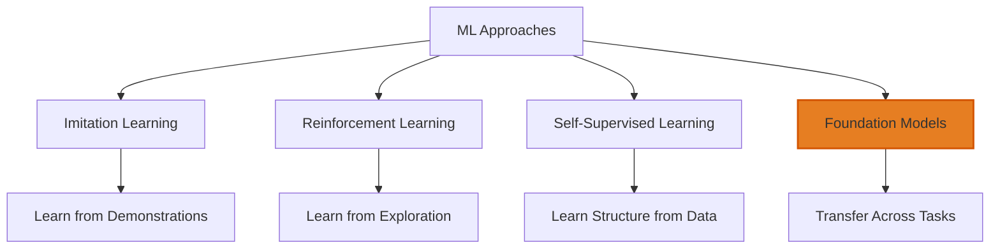
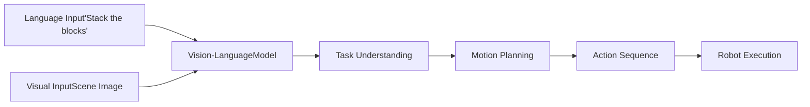
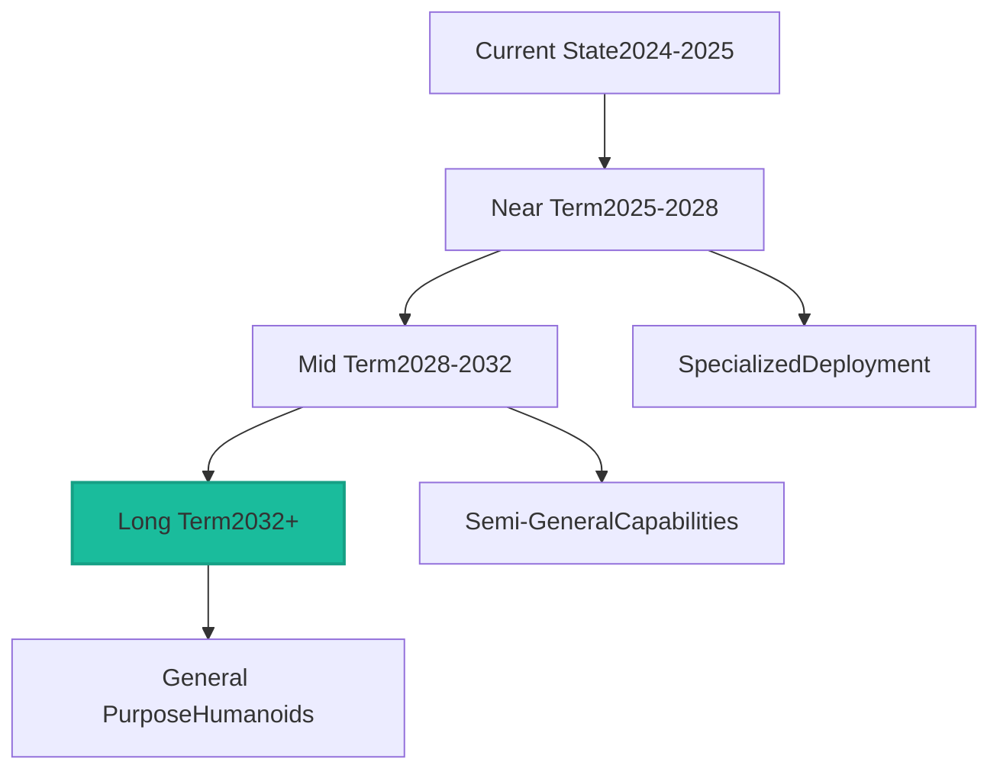

# Chapter 5: Learning and the Future of Physical AI

Traditional robotics relied on expert-designed controllers and hand-crafted behaviors. Machine learning is fundamentally changing this paradigm, enabling robots to acquire skills through data and experience. This chapter explores how learning is revolutionizing Physical AI and what the future may hold.

## The Machine Learning Revolution

The explosion of deep learning since 2012 has transformed computer vision, natural language processing, and now robotics. Physical AI is riding this wave, but with unique challenges and opportunities.

**Why Learning Matters for Robotics**: Hand-programming every behavior doesn't scale. Real-world environments are too diverse, tasks too varied. Learning enables robots to generalize from examples, adapt to new situations, and improve over time.

**The Data Challenge**: Machine learning thrives on data, but robot data is expensive. Each training sample requires physical execution, wear on hardware, and time. A robot can't parallelize data collection like a computer vision system analyzing internet images.

**Simulation as a Solution**: High-fidelity simulators allow robots to train in virtual environments where time runs faster than reality and failures have no cost. The challenge is transferring learned behaviors from simulation to the real world—the sim-to-real gap.

**Foundation Models**: Just as GPT and other large language models provide general capabilities for language tasks, researchers are developing foundation models for robotics—large models trained on diverse robot data that can adapt to new tasks with minimal additional training.

## Imitation Learning: Learning from Demonstration

One of the most intuitive approaches is learning by watching and imitating—just as humans learn many skills.

**Teleoperation and Data Collection**: Human operators control robots using VR systems, motion capture, or specialized interfaces. Their demonstrations provide training data showing how to perform tasks. Tesla's humanoid development relies heavily on this approach, with operators performing tasks while the robot records sensor data and actions.

**Behavioral Cloning**: The simplest approach treats imitation as supervised learning—train a neural network to map sensor inputs to actions that match human demonstrations. This works well for simple tasks but struggles with compounding errors and out-of-distribution situations.

**Interactive Imitation Learning**: Systems like DAgger address behavioral cloning's limitations by iteratively collecting data. The robot executes its current policy, the human provides corrections, and the policy updates. This creates a more robust dataset covering the robot's actual behavior distribution.

**Learning from Mixed Data**: Modern approaches combine human demonstrations, successful robot executions, and even internet videos. Large-scale pre-training on diverse data helps robots generalize better to new tasks.

## Reinforcement Learning: Learning Through Experience

Reinforcement Learning (RL) enables robots to discover behaviors through trial and error, guided by reward signals.

**The RL Framework**: An RL agent observes states, takes actions, and receives rewards. Over many trials, it learns a policy—a mapping from states to actions—that maximizes cumulative reward. This framework is powerful but requires significant exploration.

**Sim-to-Real Transfer**: Most RL training happens in simulation for efficiency and safety. Techniques like domain randomization—training in simulations with varied physics, lighting, and object properties—help policies generalize to the real world. Reality gap problems persist but have been substantially mitigated.

**Model-Based vs. Model-Free**: Model-free RL learns policies directly from experience without modeling environment dynamics. Model-based RL learns a world model and plans using it. Each has tradeoffs—model-free is simpler but less sample-efficient; model-based can plan ahead but requires accurate models.

**Successful Applications**: RL has achieved remarkable results in locomotion. Boston Dynamics' Atlas performs parkour using RL-trained controllers. DeepMind's work on robotic control demonstrates learning complex manipulation skills. These successes show RL's potential but also highlight remaining challenges in sample efficiency and safety.

## Transformers and Vision-Language Models

The transformer architecture that revolutionized NLP is now transforming robotics.

**Vision Transformers for Perception**: Transformers process visual data more effectively than traditional CNNs for some tasks, capturing long-range dependencies and enabling better scene understanding.

**Language-Conditioned Policies**: Combining vision, language, and action, these models enable natural language task specification. Tell a robot "pick up the red cup" and it understands both the language and how to execute the task.

**Multimodal Learning**: Models that jointly process vision, language, and proprioception can learn richer representations. This enables better generalization and more natural human-robot interaction.

**Chain-of-Thought for Robotics**: Just as language models improved by generating reasoning steps, robots are learning to break complex tasks into subtasks, reason about their feasibility, and execute them sequentially.

## Whole-Body Learning and Dexterity

Learning doesn't just improve individual skills—it's enabling qualitatively new capabilities.

**End-to-End Learning**: Rather than separate perception, planning, and control modules, end-to-end learning maps sensor inputs directly to motor commands. This can discover novel solutions but requires careful design to be safe and interpretable.

**Learning Dexterous Manipulation**: OpenAI's work solving Rubik's cube with a robot hand demonstrated learning in-hand manipulation—one of robotics' hardest problems. These successes required massive compute but showed what's possible.

**Contact-Rich Manipulation**: Tasks like insertion, assembly, or tool use involve complex contact dynamics. Learning approaches are making progress on these tasks that frustrated traditional methods.

**Bipedal Locomotion**: RL has enabled robots to learn running, jumping, and navigating challenging terrain. Policies trained purely in simulation now work on real robots, a major achievement in sim-to-real transfer.

## The Scaling Hypothesis in Robotics

In AI, many capabilities emerged only at scale—large models on large datasets. Is the same true for robotics?

**Data Scaling**: Projects like Google's RT-X are aggregating robot data across institutions and platforms. Early results suggest that larger, more diverse datasets enable better generalization—the same principle behind foundation models.

**Model Scaling**: Larger neural networks can learn more complex behaviors and generalize better. But physical constraints limit how much computation fits on a robot, creating tension between model size and deployment.

**Compute Scaling**: Training advanced robotic policies requires enormous computation—thousands of GPU-hours or more. As costs decrease and specialized hardware emerges, more aggressive scaling becomes feasible.

**The Path to AGI**: Some researchers believe scaling robot learning will be crucial for artificial general intelligence. Physical interaction provides grounding that purely digital systems lack, potentially enabling more robust and generalizable intelligence.

## Emerging Applications and Deployment

As capabilities improve, humanoid robots are moving from labs to real applications.

**Manufacturing and Warehouses**: Companies like Figure AI and Agility Robotics are deploying humanoids in warehouses and factories. Initial tasks are simple—moving boxes, simple assembly—but complexity is increasing.

**Home and Elder Care**: Aging populations drive demand for assistive robots. Humanoids could help with household tasks, provide companionship, and assist with mobility, though significant technical and social challenges remain.

**Hazardous Environments**: Disaster response, nuclear facilities, and space exploration need robots that can navigate human-built environments. Humanoids are natural candidates for these applications.

**Retail and Service**: Some companies envision humanoids in retail, hospitality, or customer service. The technology is approaching viability, but economics and social acceptance will determine adoption.

## Challenges and Limitations

Despite progress, significant challenges remain before humanoid robots become commonplace.

**Robustness and Safety**: Current systems still fail in unpredictable ways. Deploying robots in uncontrolled environments with humans requires dramatically higher reliability than current systems achieve.

**Economic Viability**: Humanoid robots cost $50,000-$250,000+ depending on capability. For many applications, specialized robots or human labor remain more cost-effective.

**Energy and Autonomy**: Limited battery life constrains operations. Major breakthroughs in energy storage or efficiency are needed for all-day autonomous operation.

**Cognitive Capabilities**: Physical capabilities are advancing faster than cognitive ones. Robots can walk and manipulate but still struggle with common-sense reasoning, understanding context, and handling novel situations.

**Ethical and Social Concerns**: As robots become more capable, questions about job displacement, privacy, safety regulation, and human-robot relationships become pressing.

## The Road Ahead

What might the next decade bring for Physical AI and humanoid robotics?

**Near-Term (2025-2028)**: Expect expanded deployments in controlled environments—factories, warehouses, specialized facilities. Capabilities will grow but still be limited to structured tasks. Costs will begin declining as production scales.

**Mid-Term (2028-2032)**: Broader deployment in semi-structured environments. Home robots handling specific tasks like cleaning or organizing. Significant improvements in dexterity and robustness. Foundation models enabling rapid task learning.

**Long-Term (2032+)**: General-purpose humanoids handling diverse tasks with minimal training. Home robots as capable assistants. Major economic impacts as automation reaches new sectors. Potentially the first glimpses of artificial general intelligence emerging from embodied systems.

**Wild Cards**: Breakthroughs in energy storage, actuation, or AI could accelerate timelines dramatically. Conversely, fundamental obstacles in safety, robustness, or intelligence could slow progress.

## Conclusion: A New Era of Robotics

We stand at the threshold of a new era. The convergence of mechanical engineering, AI, and massive investment is making humanoid robots practical for the first time. While challenges remain, the trajectory is clear—Physical AI will transform how we work, live, and interact with technology.

The future won't be built by chance. It will be shaped by the engineers, researchers, and entrepreneurs who understand these systems and push them forward. The foundations you've learned in this book prepare you to be part of that future.

The question is no longer whether humanoid robots will become widespread, but how quickly, and what we'll do with them when they arrive.