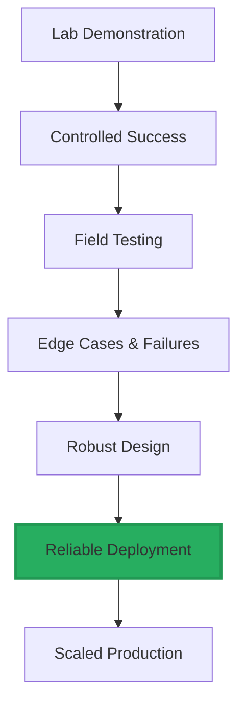

# Conclusion: The Future is Physical

Throughout this book, we've journeyed through the multifaceted world of Physical AI and humanoid robotics—from foundational principles to mechanical design, sensing and perception, locomotion and control, and finally to learning and future prospects. Now, let's reflect on what this all means and where we go from here.

## The Convergence of Disciplines

One of the most striking aspects of humanoid robotics is how it sits at the intersection of so many fields. Success requires excellence in:

- **Mechanical engineering** for robust, efficient physical designs
- **Electrical engineering** for power systems, sensors, and motor control
- **Computer science** for real-time systems, perception algorithms, and planning
- **Artificial intelligence** for learning, adaptation, and decision-making
- **Control theory** for stable, precise movement
- **Cognitive science** for understanding intelligence and interaction

No single discipline dominates. The best roboticists are T-shaped—deep in one area but with broad understanding across all of them. The integration challenges are often where the most critical problems lie.

## From Lab to Reality

For decades, humanoid robots were primarily research platforms—impressive demonstrations that nonetheless remained confined to laboratories. That's changing rapidly.

**Economic Reality**: The cost of humanoid robots is dropping while capabilities rise. Tesla aims to produce Optimus at scale for under $20,000. At that price point, the economic case for deployment becomes compelling for many applications.

**Manufacturing Maturity**: The robotics industry is maturing. Supply chains, manufacturing processes, and operational knowledge are developing. Early deployments are teaching the industry what works and what doesn't.

**AI as the Catalyst**: The AI revolution, particularly in vision and learning, has removed major bottlenecks. Robots can now perceive and learn in ways that were impossible a decade ago. This is the key enabler making real-world deployment feasible.

## Key Insights

Several themes have emerged throughout our exploration:

**Embodiment Matters**: Physical constraints fundamentally shape what's possible. The lessons from simulated AI don't directly transfer. Understanding mechanics, dynamics, and the real world's messiness is essential.

**Trade-offs Are Everywhere**: Every design choice involves trade-offs. More DOF enables more capability but increases complexity. Stronger actuators add weight. Better sensors cost more and consume more power. Good design navigates these trade-offs wisely.

**Integration Is the Hard Part**: Individual components may work beautifully in isolation, but making them work together reliably is the real challenge. System-level thinking separates successful projects from failures.

**Learning Changes Everything**: Machine learning isn't just an incremental improvement—it's a paradigm shift. Robots can now acquire capabilities that would be nearly impossible to hand-program.

**Robustness Is Critical**: A robot that works 99% of the time isn't good enough for real deployment. The difference between lab demonstrations and practical systems is often in that last few percent of reliability.

## Opportunities and Responsibilities

As humanoid robots become more capable and widespread, we face both opportunities and responsibilities.

**Opportunities**: Robots can take on dangerous, repetitive, or physically demanding work. They can assist the elderly, work in hazardous environments, and augment human capabilities. The economic value could be immense, potentially rivaling the internet's impact.

**Responsibilities**: We must consider job displacement, ensure safety, protect privacy, and think carefully about human-robot relationships. The technology will be shaped by the choices we make now about how to develop and deploy it.

**Inclusivity**: The benefits of robotics should be broadly distributed, not concentrated. This requires conscious effort in policy, business models, and technology development.

## For the Aspiring Roboticist

If you're inspired to work in this field, here's practical advice:

**Build Things**: Theory matters, but robotics is ultimately about making physical systems work. Start with simple projects—even a basic robot arm teaches valuable lessons. Iterate, fail, learn, and improve.

**Master the Fundamentals**: Linear algebra, dynamics, control theory, and programming aren't optional. These foundations enable you to solve novel problems rather than just following tutorials.

**Embrace Interdisciplinarity**: Study broadly. Take a course outside your main field. Read papers from adjacent disciplines. The best insights often come from combining ideas from different areas.

**Stay Current**: The field moves quickly. Follow key conferences (ICRA, IROS, RSS, CoRL), read recent papers, and watch what companies are building. What's impossible today may be standard tomorrow.

**Think Systemically**: Focus on the whole system, not just your specialty. How do your components integrate with others? What are the downstream implications of your design choices?

## The Bigger Picture

Humanoid robotics is part of a larger story—humanity's relationship with technology and intelligence.

**Extending Human Capability**: Throughout history, tools have extended human capabilities. Robots represent perhaps the ultimate tool—artificial entities that can act autonomously on our behalf.

**Understanding Intelligence**: Building intelligent physical systems teaches us about intelligence itself. Embodiment, as it turns out, deeply shapes cognition. Physical AI research contributes to broader questions about mind and intelligence.

**Shaping the Future**: The next few decades will determine how robots integrate into society. The choices made by today's researchers, engineers, and entrepreneurs will echo for generations.

## Final Thoughts

Physical AI and humanoid robotics represent one of the most exciting technological frontiers of our time. The convergence of AI, robotics, and manufacturing is creating machines that seemed like science fiction just years ago.

We've covered a lot of ground in this book—from the basics of embodiment and degrees of freedom to advanced learning algorithms and future trajectories. If you've made it this far, you have a solid foundation for understanding current systems and future developments.

But understanding is just the beginning. The field needs talented, thoughtful people to push it forward. Whether you become a researcher advancing the state of the art, an engineer building practical systems, an entrepreneur creating new applications, or simply an informed observer who understands what's happening—your engagement matters.

The robots are coming, but not in the way science fiction often portrayed. They're coming as tools, assistants, and coworkers. They'll be clumsy at first, improving gradually, until one day we'll wonder how we managed without them.

**The future is physical. And it's being built right now.**

---

## Further Reading and Resources

To continue your journey in Physical AI and humanoid robotics:

**Key Conferences**:
- ICRA (International Conference on Robotics and Automation)
- IROS (International Conference on Intelligent Robots and Systems)
- RSS (Robotics: Science and Systems)
- CoRL (Conference on Robot Learning)

**Important Organizations**:
- Boston Dynamics, Tesla Bot (Optimus), Figure AI, Agility Robotics
- Research labs: MIT CSAIL, CMU Robotics Institute, Berkeley AI Research, Stanford AI Lab

**Online Resources**:
- ArXiv robotics papers (cs.RO)
- ROS (Robot Operating System) documentation and tutorials
- YouTube channels of robotics companies and research labs

**Foundational Textbooks**:
- "Modern Robotics" by Lynch and Park
- "Probabilistic Robotics" by Thrun, Burgard, and Fox
- "Robotics, Vision and Control" by Peter Corke

The journey continues. Where will you take it?