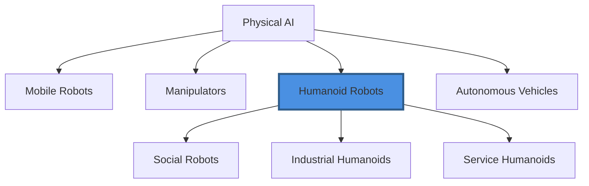

# Introduction to Physical AI & Humanoid Robotics

Welcome to the fascinating world where artificial intelligence meets the physical realm. Physical AI represents a paradigm shift in how we think about intelligent systems—moving beyond screens and virtual environments to machines that can sense, move, and interact with the real world.

## What is Physical AI?

Physical AI refers to artificial intelligence systems that are embodied in physical forms—robots, autonomous vehicles, drones, and humanoids that can perceive their environment through sensors, make decisions, and take actions that affect the physical world. Unlike traditional AI that operates in digital spaces, Physical AI must contend with the messiness, uncertainty, and complexity of reality.

The convergence of advanced AI algorithms, sophisticated sensors, and precise actuators has made it possible to create machines that can:

- Navigate dynamic, unstructured environments
- Manipulate objects with human-like dexterity
- Learn from physical interactions
- Adapt to unexpected situations in real-time

## The Rise of Humanoid Robotics

Among all forms of Physical AI, humanoid robots hold special significance. By mimicking the human form, these machines can navigate spaces designed for humans, use tools built for human hands, and interact with people in intuitive ways. Recent breakthroughs from companies like Tesla (Optimus), Boston Dynamics (Atlas), Figure AI, and Agility Robotics (Digit) have demonstrated that humanoid robots are transitioning from research labs to practical applications.

## Why Humanoids Matter

The human form is not arbitrary—it's the result of millions of years of evolution optimized for versatile interaction with our environment. By building robots in our image, we gain several advantages:

**Universal Design Compatibility**: Our world is built for humans. Stairs, doorknobs, vehicles, and tools are all designed for the human body. A humanoid robot can navigate this world without requiring us to redesign everything.

**Intuitive Interaction**: Humans naturally understand humanoid body language and movement. This makes human-robot collaboration more intuitive and reduces the learning curve for working alongside these machines.

**Versatility**: The human form allows for an enormous range of tasks. A single humanoid platform can potentially replace multiple specialized robots, making it economically attractive for diverse applications.

## Current State and Future Promise

We stand at an inflection point in Physical AI development. The combination of deep learning breakthroughs, improved hardware, and massive investment has accelerated progress dramatically. Tasks that seemed impossible a decade ago—like bipedal walking on varied terrain or dexterous manipulation of unknown objects—are now being solved.

However, significant challenges remain. Humanoid robots still struggle with energy efficiency, robust operation in uncontrolled environments, and the kind of common-sense reasoning that humans take for granted. The path forward requires advances in mechanical design, sensing and perception, control systems, and machine learning.

## What You'll Learn

This book provides a comprehensive introduction to Physical AI and humanoid robotics, covering:

- **Foundational Concepts**: The key principles that enable physical intelligence
- **Mechanical Design**: How humanoid robots are built and why design choices matter
- **Sensing and Perception**: How robots understand their environment
- **Locomotion and Control**: The science of making robots move gracefully and efficiently
- **Learning and the Future**: How AI is making robots smarter and what lies ahead

Whether you're an engineer, researcher, student, or simply curious about the future of robotics, this book will give you the knowledge to understand and engage with this transformative technology.

## A Living Field

Physical AI and humanoid robotics are rapidly evolving fields. What was cutting-edge research yesterday becomes commercial reality today. As you read this book, remember that new breakthroughs are continuously emerging. The foundations you'll learn here will help you understand not just current systems, but future innovations as well.

Let's begin our journey into the world where intelligence takes physical form.

---

*💡 **Tip**: Highlight any text and ask the AI assistant on the right →*